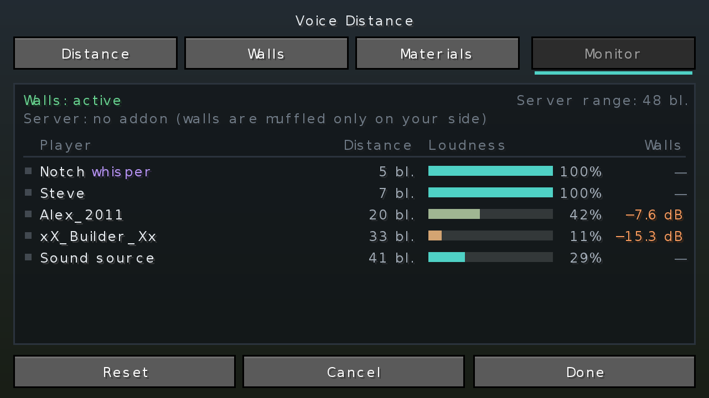
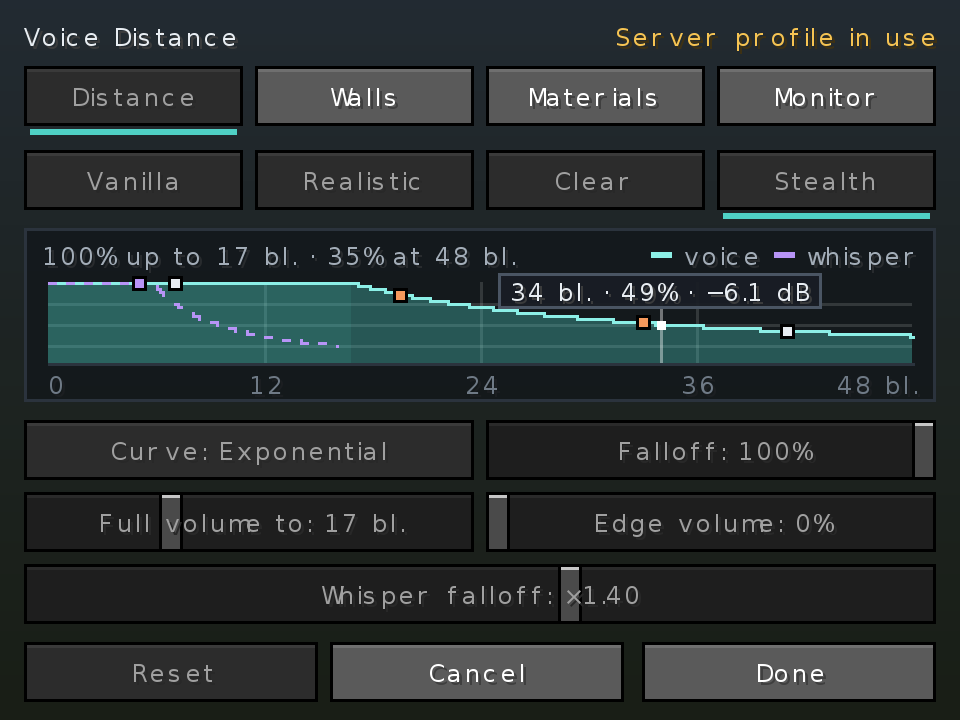

# Voice Physics

**English** · [Русский](README.ru.md)

An addon for [Simple Voice Chat](https://modrinth.com/plugin/simple-voice-chat) that makes voices behave like sound: they fade with distance, get muffled behind walls, come round corners through doorways and echo in caves. Servers get sound zones, game rules and wall muffling even for players without the addon.

[](https://modrinth.com/project/u8mD6TL9)
[](https://www.curseforge.com/projects/1712556)
[](https://github.com/Shamanalle/voice-physics/releases)
[](#versions-and-files)
[](LICENSE)

| Distance | Walls | Monitor | Server profile |
|---|---|---|---|
|  |  |  |  |

## Contents

- [Quick start](#quick-start)
- [For players](#for-players)
- [For servers](#for-servers)
- [What works where](#what-works-where)
- [Versions and files](#versions-and-files)
- [Compatibility](#compatibility)
- [Commands](#commands)
- [Settings files](#settings-files)
- [Building](#building)

## Quick start

**Which file:** Fabric, Quilt, Forge and NeoForge get the full addon, with a file for each range of Minecraft versions. Paper, Purpur, Folia and Spigot servers get the plugin. Only Forge and NeoForge 1.20.2 – 1.20.4 get a lite version with the distance curve only. The exact file for your version is in [Versions and files](#versions-and-files).

**Player**
1. Install [Simple Voice Chat](https://modrinth.com/plugin/simple-voice-chat) and, on Fabric, [Fabric API](https://modrinth.com/mod/fabric-api).
2. Put the addon's `.jar` into `.minecraft/mods/`.
3. In game press `V` → **Voice Physics…**, or type `/voicephysics` (also in Mod Menu, or on your own key in *Controls*). Changes are heard at once; *Cancel* undoes them.

**Server**
1. Fabric, Forge or NeoForge: put the same `.jar` into `mods/`. Paper, Purpur, Folia or Spigot: put `voice-physics-bukkit-*.jar` into `plugins/`. Simple Voice Chat must be installed.
2. Start the server once. Walls for players without the addon are already on.
3. Set up the rest with `/vcd` in game, on the *Server* tab of the settings screen, or in the [settings file](#server-file). The file is re-read without a restart.

## For players

These need the addon on your client and work on any server with Simple Voice Chat.

### Distance
- Three fade curves: like Simple Voice Chat (straight), realistic, or steep. Every curve fades out at the edge of the range instead of cutting off.
- You set how far voices stay at full volume, how fast they fade, how loud they stay at the edge, and how fast whispers fade.
- A live graph shows the volume at every distance and the players you hear right now. *Listen* plays a voice walking away along the curve.
- Presets, which adapt to each server's voice range:

  | Preset | For | Full volume up to |
  |---|---|---|
  | Vanilla | Exactly like Simple Voice Chat | half the range |
  | Realistic | Everyday play | about 12 blocks |
  | Clear | Events: everyone stays understandable | about 24 blocks |
  | Stealth | Hide-and-seek, horror | about 7 blocks |

### Walls
- A voice behind a wall is quieter and duller; the thicker the wall, the more.
- Materials differ: wool and metal block more than stone, glass and leaves less. Open doors and trapdoors count a tenth of a closed one; slabs, fences and carpets let sound past by their shape. Iron and copper doors count as metal. Every material's weight can be changed on the *Walls* tab, under *Materials*.
- Players side by side in a narrow tunnel hear each other clearly.

### Round corners
- A voice from the next room comes through the doorway or window, from its direction and at the length of the way round.
- The sharper the turn, the duller the voice. The direction glides as you walk past a doorway.
- The HUD shows *round a corner* for such voices.

### Echo, water and rain
- The echo depends on the place: a stone room rings briefly, a cave or hall for 2–3 seconds, a wooden house briefly and softly. Forests, fields and wool rooms have none.
- Near cliffs and in canyons the voice comes back a moment later.
- The speaker's surroundings count too: a friend in a cave echoes even when you are outside. A voice right next to you stays clear.
- The echo changes smoothly, over about a second and a half, as you walk from a field into a cave or out of a hall.
- Under water voices are dull and quieter.
- Rain and thunder cover far voices under the open sky.
- The *Effects* tab has a switch for each, sliders for how strong the echo, water and rain are, and shows what kind of place you are in.

### HUD
- A small panel in a screen corner: who is talking, how far away, from which side, and whether they whisper, are behind a wall or round a corner.
- While you talk: how many players hear you and how many cannot (no voice chat, sound off). In a Simple Voice Chat group it counts the group (needs the addon on the server).
- Modes: off, while someone talks, always. Size, corner, background, a compact one-line mode, with a preview on the *HUD* tab. A key cycles the modes.

### Monitor and radar
- Everyone within voice range, talking or not: distance, direction, how loud they reach you and how much the walls take.
- Who has no voice chat, has it disconnected, turned the sound off or is in a group.
- A radar view shows the same from above.
- Invisible players, spectators and players hidden by vanish plugins are not shown.

### Also
- **Profile codes:** copy all your sound settings as one line and send it to a friend, who pastes it.
- **Colorblind colors** for the HUD, monitor and radar, on the *HUD* tab.
- **Seven languages:** English, Russian, Ukrainian, German, Spanish, Brazilian Portuguese, Chinese (Simplified).

## For servers

Available in the full Fabric, Forge and NeoForge mods and as a plugin for Paper, Purpur, Folia, Spigot and Bukkit.

- **Walls for everyone.** Players without the addon also hear voices muffled through walls. Load is capped: above 24 voices at once (adjustable) the rest pass unfiltered, and on any error the original audio is sent, so voice chat never goes silent.
- **Sound zones.** Draw a box in game with `/vcd zone`, use a whole world, a WorldGuard region on Paper, or the claims of a player or party with [Open Parties and Claims](https://modrinth.com/mod/open-parties-and-claims) on Fabric, Forge and NeoForge. A zone can:
  - change the voice range: a stage ×2, a library ×0.4, or a range in blocks;
  - be *isolated*: no voice gets in or out;
  - set its own wall strength, a constant echo (a cathedral) or none;
  - show a message on entering.

  Entering and leaving a zone is shown above the hotbar to every player, with or without the addon (`/vcd notices off` turns it off). `/vcd zone show <name>` draws a box's borders with particles.
- **Game rules.** Sneaking players carry less far. Dead players are silent until they respawn. Spectators are heard only by spectators. An item in hand, such as a goat horn, works as a megaphone. You choose which rules also apply inside Simple Voice Chat groups.
- **One sound for everyone.** Offer the server's sound profile with a button, or enforce it while players are on the server (fair PvP and events). Lock all of it or only some parts: curve, walls, materials, effects. Locked walls lock each block's percentage too.
- **No seeing through walls.** Turn off the monitor, the radar and nearby players in the HUD.
- **Require the addon.** Players with Simple Voice Chat but without the addon can get a download link once, on every join, or be kicked. Players without voice chat are never affected.
- **Admin tools.** A *Server* tab in the settings screen, [`/vcd`](#commands) with clickable replies, examples in its help, undo and separate permissions, a log of who changed what (`/vcd log`), `/vcd debug <player>` to see whom a player hears and why not, and messages in each player's own language (all texts can be edited).

## What works where

| | Client only | Server only | Both |
|---|:---:|:---:|:---:|
| Distance curve, presets | ✅ | — | ✅ + server profile |
| Walls | ✅ for you | ✅ for players without the addon | ✅ |
| Round corners, echo, water, rain | ✅ | — | ✅ |
| HUD, monitor, radar | ✅ | — | ✅ + voice chat state of every player |
| Zones: range, walls, isolation | — | ✅ | ✅ |
| Zones: names above the hotbar | — | ✅ | ✅ |
| Zones: echo | — | — | ✅ |
| Game rules, addon requirement, `/vcd` | — | ✅ | ✅ |
| Server tab, locked settings, monitor off | — | — | ✅ |
| Exact whisper range on the graph | approximate | — | ✅ |

With the addon on both sides the client muffles walls itself and the server skips those players, so nothing is muffled twice.

## Versions and files

| Loader | Minecraft | File | Java | Simple Voice Chat |
|---|---|---|---|---|
| **Fabric / Quilt** | 1.20 – 1.20.1 | `voice-physics-fabric-2.6.0+mc1.20.1.jar` | 17+ | 2.4.0+ |
| **Fabric / Quilt** | 1.20.2 – 1.20.4 | `voice-physics-fabric-2.6.0+mc1.20.2-1.20.4.jar` | 17+ | 2.4.0+ |
| **Fabric / Quilt** | 1.20.5 – 1.20.6 | `voice-physics-fabric-2.6.0+mc1.20.5-1.20.6.jar` | 21+ | 2.5.0+ |
| **Fabric / Quilt** | 1.21 – 1.21.11 | `voice-physics-fabric-2.6.0+mc1.21.x.jar` | 21+ | 2.5.0+ |
| **Fabric** | 26.1 – 26.3 | `voice-physics-fabric-2.6.0+mc26.x.jar` | 25+ | 2.6.0+ |
| **Forge** | 1.20.1 | `voice-physics-forge-2.6.0+mc1.20.1.jar` | 17+ | 2.4.0+ |
| **Forge** | 1.20.6 | `voice-physics-forge-2.6.0+mc1.20.6.jar` | 21+ | 2.5.0+ |
| **Forge** | 1.21.1 | `voice-physics-forge-2.6.0+mc1.21.1.jar` | 21+ | 2.5.0+ |
| **Forge** | 1.21.3 – 1.21.5 | `voice-physics-forge-2.6.0+mc1.21.3-1.21.5.jar` | 21+ | 2.5.0+ |
| **Forge** | 1.21.6 – 1.21.8 | `voice-physics-forge-2.6.0+mc1.21.6-1.21.8.jar` | 21+ | 2.5.0+ |
| **Forge** | 1.21.9 – 1.21.10 | `voice-physics-forge-2.6.0+mc1.21.9-1.21.10.jar` | 21+ | 2.5.0+ |
| **Forge** | 1.21.11 | `voice-physics-forge-2.6.0+mc1.21.11.jar` | 21+ | 2.5.0+ |
| **Forge** | 26.1 – 26.3 | `voice-physics-forge-2.6.0+mc26.x.jar` | 25+ | 2.6.0+ |
| **NeoForge** | 1.20.5 – 1.20.6 | `voice-physics-neoforge-2.6.0+mc1.20.5-1.20.6.jar` | 21+ | 2.5.0+ |
| **NeoForge** | 1.21 – 1.21.1 | `voice-physics-neoforge-2.6.0+mc1.21-1.21.1.jar` | 21+ | 2.5.0+ |
| **NeoForge** | 1.21.2 – 1.21.5 | `voice-physics-neoforge-2.6.0+mc1.21.2-1.21.5.jar` | 21+ | 2.5.0+ |
| **NeoForge** | 1.21.6 – 1.21.8 | `voice-physics-neoforge-2.6.0+mc1.21.6-1.21.8.jar` | 21+ | 2.5.0+ |
| **NeoForge** | 1.21.9 – 1.21.10 | `voice-physics-neoforge-2.6.0+mc1.21.9-1.21.10.jar` | 21+ | 2.5.0+ |
| **NeoForge** | 1.21.11 | `voice-physics-neoforge-2.6.0+mc1.21.11.jar` | 21+ | 2.5.0+ |
| **NeoForge** | 26.1 – 26.3 | `voice-physics-neoforge-2.6.0+mc26.x.jar` | 25+ | 2.6.0+ |
| **Paper / Purpur / Folia / Spigot / Bukkit** | 1.20.1 – 26.3 | `voice-physics-bukkit-2.6.0.jar` | 17+ | Bukkit version |
| NeoForge / Forge (lite) | 1.20.2 – 1.20.4 | `voice-physics-{neoforge,forge}-2.6.0+mc1.20.2-1.20.4.jar` | 17+ | 2.4.0+ |

- **Fabric**, **Forge** and **NeoForge** are the full addon, for the client and the server. Fabric needs [Fabric API](https://modrinth.com/mod/fabric-api); [Mod Menu](https://modrinth.com/mod/modmenu) is optional. On Forge for 1.21.6 – 1.21.7 the voice HUD is off: that Forge cannot add it.
- **The plugin** is the server side only. Players can join with the addon, without it, or without mods at all.
- **Lite** (Forge and NeoForge 1.20.2 – 1.20.4) has the distance curve only, set in `config/vc-audio-distance.properties`: no settings screen, walls, effects, HUD or server side.

## Compatibility

- **Sound Physics Remastered:** when it is installed, the addon leaves walls, echo and water to it, so nothing is applied twice. Rain still works.
- **Simple Voice Chat groups:** a group hears its members anywhere, so walls and range do not apply inside it. Game rules apply only where the server turns them on.
- **Vanish plugins** (Paper): hidden players stay hidden in the monitor too.

## Commands

### For players: `/voicephysics`

Works on any server, with or without the addon there.

| Command | What it does |
|---|---|
| `/voicephysics` | Open the settings |
| `/voicephysics distance\|walls\|effects\|hud\|monitor\|server` | Open the settings on that tab |
| `/voicephysics preset vanilla\|realistic\|clear\|stealth` | Your sound preset |
| `/voicephysics hud off\|talking\|always`, `hud compact on\|off` | The voice HUD |
| `/voicephysics code` | Your profile code, with a *Copy* button |
| `/voicephysics code <code>` | Load a profile code |
| `/voicephysics reset curve\|walls\|materials\|effects\|hud\|all` | Back to the defaults |
| `/voicephysics status` | What this server does to your sound: its profile, what it locks, your zone, the voice range |
| `/voicephysics help` | These commands, clickable |

Parts the server locks cannot be changed from here either.

### For servers: `/vcd`

Replies are coloured and clickable: values in `/vcd status` put the command that changes them in the chat box, zones in `/vcd zones` have *Info*, *Show* and *Go there* buttons, and every change has an *Undo* button. Tab completion offers zone, world and player names and the values each setting takes. Changes are saved to the settings file and reach players at once.

| Command | What it does |
|---|---|
| `/vcd` or `/vcd status` | Version, voice range, walls, players with the addon, profile, zones |
| `/vcd help [command]` | Every command, or one with examples to click |
| `/vcd undo` | Take back the last change (up to 10) |
| `/vcd log [page]` | Who changed the settings and when, newest first (also kept in `vc-audio-distance-changes.log` next to the settings file) |
| `/vcd reload` | Re-read the settings file |
| `/vcd profile off\|suggest\|enforce` | How the server profile is offered |
| `/vcd preset vanilla\|realistic\|clear\|stealth\|custom` | The server's sound |
| `/vcd preset export` / `import <code>` | The server's profile as a profile code |
| `/vcd walls 0-100\|off` | Wall strength for everyone, in % |
| `/vcd serverwalls on\|off` | Walls for players without the addon |
| `/vcd lock all\|none\|curve,walls,materials,effects` | What players cannot change while the profile is enforced |
| `/vcd monitor on\|off` | Monitor, radar and nearby players in the HUD |
| `/vcd notices on\|off` | A zone's name above the hotbar when players enter or leave it |
| `/vcd zones [page]` | Every zone, with buttons |
| `/vcd zone pos1\|pos2 [x y z \| ~ ~ ~ \| look]` | A corner of a box: where you stand, at coordinates, or the block you look at. The selection is shown with particles |
| `/vcd zone create <name> [radius]` | A box from the two corners, or around you |
| `/vcd zone info [name]` | A zone's settings; click one to change it. Without a name: the zone you are in |
| `/vcd zone set <name\|claim:player> <setting> [value\|default]` | `mode`, `preset`, `voice_range`, `whisper_range`, `range_multiplier`, `walls`, `echo`, `isolated`, `message`, `priority`. Without a value: the current one and the choices |
| `/vcd zone show <name>\|off` | Draw a box's borders with particles for 30 seconds (only you see them) |
| `/vcd zone tp <name>` | Go to the middle of a box |
| `/vcd zone rename <name> <new name>` | Rename a box; its settings stay |
| `/vcd zone delete <name>` | Remove a zone (asks first; `/vcd undo` brings it back) |
| `/vcd rule sneak 0.1-1\|dead on\|off\|spectators on\|off\|megaphone <item>\|megaphone_range 1-10` | Game rules |
| `/vcd group dead\|spectators\|zones\|open_range on\|off` | Rules inside Simple Voice Chat groups |
| `/vcd require off\|suggest\|warn\|kick [version]` | Addon requirement |
| `/vcd debug [player]` | Whom a player hears, who hears them, and why not (without a name: you) |

**Permissions.** The console may do everything. On Paper each part of `/vcd` has its own permission; operators have all of them:

| Permission | Allows |
|---|---|
| `vcd.status` | `status`, `help`, `zones`, `zone info` |
| `vcd.settings` | `profile`, `preset`, `walls`, `serverwalls`, `lock`, `monitor`, `notices`, `rule`, `group`, `require`, `reload`, `undo`, `log` |
| `vcd.zone` | Making, changing, showing and deleting zones |
| `vcd.debug` | `debug` |
| `vcd.admin` | All of the above |

On Fabric, Forge and NeoForge `/vcd` is for operators (level 2+). With LuckPerms or another mod that uses fabric-permissions-api, Fabric checks the same permissions. The *Server* tab shows to anyone who may use any part of `/vcd`.

## Settings files

Everything here can also be set in game. Every key in the files has a comment in English and Russian.

### Client file

`config/vc-audio-distance.properties`

<details>
<summary>All client settings</summary>

| Key | Values | Default | What it does |
|---|---|---|---|
| `distance_model` | `linear` / `realistic_inverse` / `exponential` | `linear` | Shape of the curve |
| `attenuation_factor` | 0 – 1 | 1.0 | How fast voices fade |
| `openal_reference_ratio` | 0.05 – 1 | 0.5 | Share of the range heard at full volume |
| `min_volume_fraction` | 0 – 0.5 | 0.0 | Volume at the edge of the range |
| `whisper_multiplier` | 0.5 – 2 | 1.0 | How fast whispers fade, relative to voices |
| `occlusion_enabled` | true / false | true | Walls muffle voices |
| `occlusion_strength` | 0 – 1 | 0.6 | How strongly |
| `material.<id>` | 0 – 3 | see *Walls* → *Materials* | How much one block muffles; stone = 1 |
| `reverb_enabled` | true / false | true | Echo |
| `reverb_strength` | 0 – 1 | 0.6 | Echo strength |
| `underwater_enabled` | true / false | true | Dull voices under water |
| `underwater_strength` | 0 – 1.5 | 1 | How dull and quiet voices get under water |
| `weather_enabled` | true / false | true | Rain and thunder cover far voices |
| `weather_strength` | 0 – 1.5 | 1 | How much rain and thunder cover them |
| `diffraction_enabled` | true / false | true | Voices come round corners |
| `hud_mode` | `off` / `talking` / `always` | `talking` | When the HUD is shown |
| `hud_corner` | `top_left` / `top_right` / `bottom_left` / `bottom_right` | `top_right` | HUD corner |
| `hud_scale` | 0.5 – 1.5 | 1.0 | HUD size |
| `hud_background` | 0 – 1 | 0.55 | HUD background opacity |
| `hud_compact` | true / false | false | One HUD line for everyone talking |
| `colorblind` | true / false | false | Colors for red-green color blindness |

</details>

### Server file

`config/vc-audio-distance-server.properties` on Fabric, Forge and NeoForge, `plugins/VoicePhysics/vc-audio-distance-server.properties` on Paper (before 2.2.0 `plugins/VoicechatAudioDistance/`, moved automatically). Changes apply within 2 seconds. The voice and whisper range itself is set in Simple Voice Chat (`max_voice_distance`, `whisper_distance`).

<details>
<summary>Walls</summary>

| Key | Values | Default | What it does |
|---|---|---|---|
| `walls_strength` | 0 – 1 | 0.6 | How strongly walls muffle, for everyone; 0 turns walls off |
| `material.<id>` | 0 – 3 | stone 1.0, metal 1.3, earth 0.9, wood 0.7, wool 1.4, soft 1.2, glass 0.4, ice 0.7, door 0.6, leaves 0.15, thin 0.2, liquid 0.35, other 1.0 | How much one block muffles |
| `server_walls` | true / false | true | The server muffles walls for players without the addon |
| `server_walls_max_streams` | 0 – 512 | 24 | Most voices muffled at once; the rest pass unfiltered |

</details>

<details>
<summary>Server profile (players with the addon)</summary>

| Key | Values | Default | What it does |
|---|---|---|---|
| `profile_mode` | `off` / `suggest` / `enforce` | `off` | Players keep their settings / get a button to apply the profile / use it while on the server |
| `profile_locked` | `all`, `none`, or any of `curve,walls,materials,effects` | `all` | With `enforce`: what players cannot change; `walls` brings `materials` along |
| `profile_preset` | `vanilla` / `realistic` / `clear` / `stealth` / `custom` | `custom` | The server's sound; `custom` uses the `profile.*` keys |
| `profile.distance_model`, `.attenuation_factor`, `.openal_reference_ratio`, `.min_volume_fraction`, `.whisper_multiplier` | as in the client file | client defaults | The custom curve |
| `profile.reverb_enabled`, `.reverb_strength`, `.underwater_enabled`, `.underwater_strength`, `.weather_enabled`, `.weather_strength`, `.diffraction_enabled` | as in the client file | client defaults | Effects; always part of the profile, whatever the preset |
| `allow_monitor` | true / false | true | `false`: no monitor, radar or nearby players in the HUD |
| `zone_notices` | true / false | true | A zone's name above the hotbar on entering and leaving, for every player |

</details>

<details>
<summary>Zones</summary>

| Key | Values | What it does |
|---|---|---|
| `zone.<kind>.<name>.voice_range`, `.whisper_range` | 1 – 1000 blocks | Voice and whisper range here |
| `zone.<kind>.<name>.range_multiplier` | 0.05 – 10 | Range times this: 2 = stage, 0.4 = library |
| `zone.<kind>.<name>.isolated` | true / false | No voice gets in or out |
| `zone.<kind>.<name>.walls_strength` | 0 – 1 | Wall strength here |
| `zone.<kind>.<name>.echo` | `auto` / `off` / 0.1 – 1 | Measured as usual / none / this much everywhere here |
| `zone.<kind>.<name>.profile_mode`, `.profile_preset` | as above | The profile here |
| `zone.<kind>.<name>.enter_message` | text | Shown on entering |
| `zone.<kind>.<name>.priority` | whole number | Where zones overlap the highest wins (default 0) |
| `zone.box.<name>.world`, `.from`, `.to` | world, `x,y,z`, `x,y,z` | The box; `/vcd zone create` writes it |

`<kind>` is `world`, `box`, `region` (WorldGuard, Paper) or `claim` (Open Parties and Claims: `zone.claim.<player>` covers that player's claims and, for a party leader, the whole party's; `zone.claim.server` the server's own claims). A world is its folder name on Paper (`world_nether`) and its dimension on Fabric, Forge and NeoForge (`the_nether`). On equal priority a region wins, then the smaller box. Anything a zone does not set comes from the rest of the file.

```properties
# A stage heard twice as far, and a soundproof booth
zone.box.stage.world=world
zone.box.stage.from=0,60,0
zone.box.stage.to=30,80,20
zone.box.stage.range_multiplier=2
zone.box.stage.enter_message=On stage: everyone hears you
zone.box.booth.world=world
zone.box.booth.from=40,60,0
zone.box.booth.to=44,64,4
zone.box.booth.isolated=true
```

</details>

<details>
<summary>Game rules and groups</summary>

| Key | Values | Default | What it does |
|---|---|---|---|
| `sneak_range_multiplier` | 0.1 – 1 | 1 | Voice range while sneaking, times this |
| `dead_players_silent` | true / false | false | Dead players are silent until they respawn |
| `spectators_hear_only_spectators` | true / false | false | Spectators are heard only by spectators |
| `megaphone_item` | item id or empty | empty | Item that works as a megaphone, e.g. `minecraft:goat_horn` |
| `megaphone_multiplier` | 1 – 10 | 2.5 | Voice range with the megaphone, times this |
| `group_dead_silent` | true / false | false | Dead players are silent in their group too |
| `group_spectators_apart` | true / false | false | Spectators in a group are heard only by its spectators |
| `group_isolated_zones` | true / false | false | Isolated zones cut group voices too |
| `open_group_range` | true / false | true | In open groups, zone range, sneaking and the megaphone apply to the voice nearby players hear |

</details>

<details>
<summary>Addon requirement and messages</summary>

| Key | Values | Default | What it does |
|---|---|---|---|
| `require_addon` | `off` / `suggest` / `warn` / `kick` | `off` | Players without the addon: nothing / one message per server start / a message on every join / disconnect |
| `min_addon_version` | version or empty | empty | Oldest addon version that counts |
| `addon_download_url` | link | GitHub releases | Where the message sends players |
| `messages_language` | `auto` / `en_us` / `ru_ru` / `uk_ua` / `de_de` / `es_es` / `pt_br` / `zh_cn` | `auto` | Language of `/vcd` replies and player messages; `auto` = each player's game language |

The texts are in `vc-audio-distance-lang/<language>.json` next to the settings file. Edit any line, or add a file such as `fr_fr.json` for a new language; missing lines fall back to the built-in ones.

</details>

## Building

JDK 25 is required.

```bash
git clone https://github.com/Shamanalle/voice-physics.git
cd voice-physics
./gradlew build   # every jar ends up in build/libs/
```

How the project is laid out and how to contribute: [CONTRIBUTING.md](CONTRIBUTING.md). Changes by version: [CHANGELOG.md](CHANGELOG.md).

## License

[MIT](LICENSE) © Shamanalle
