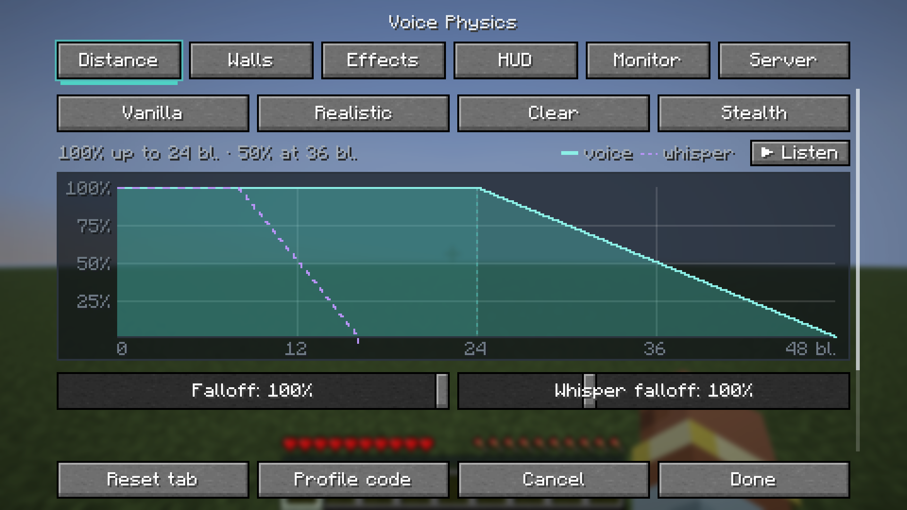
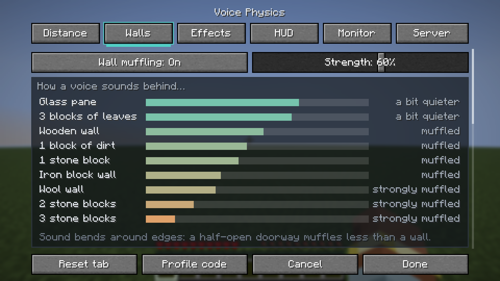
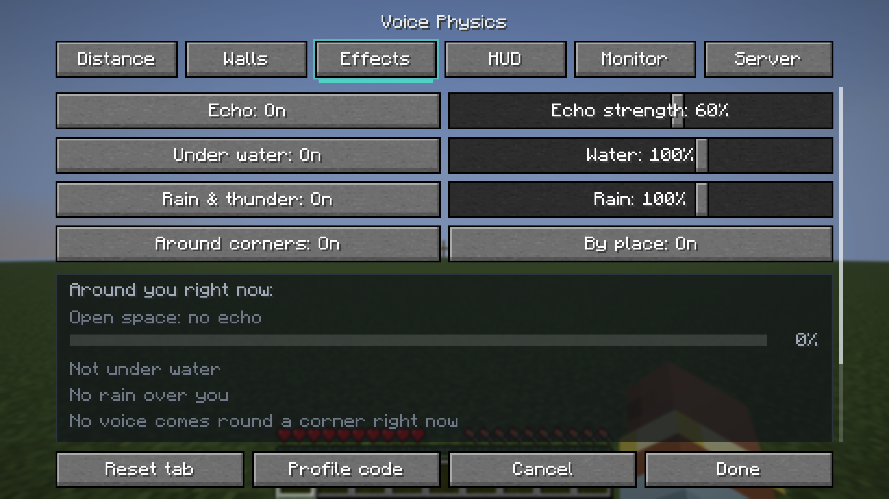
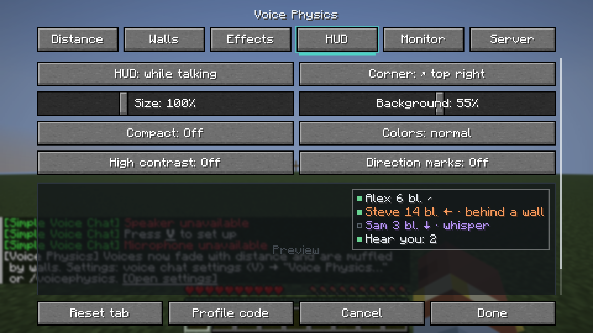
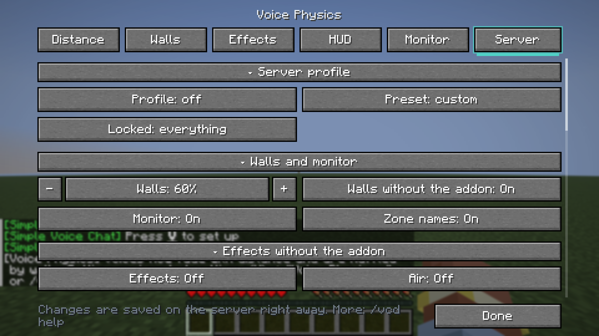
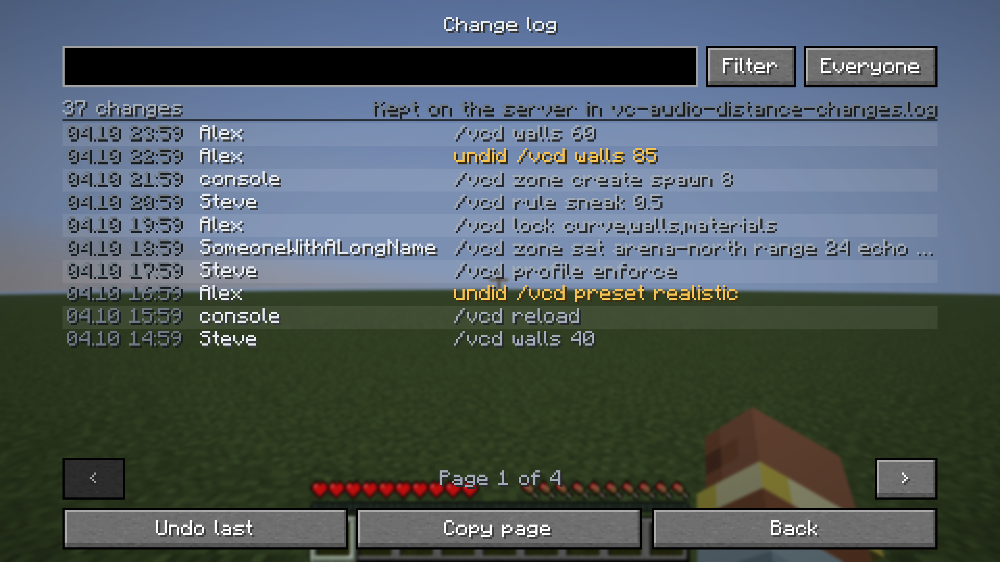
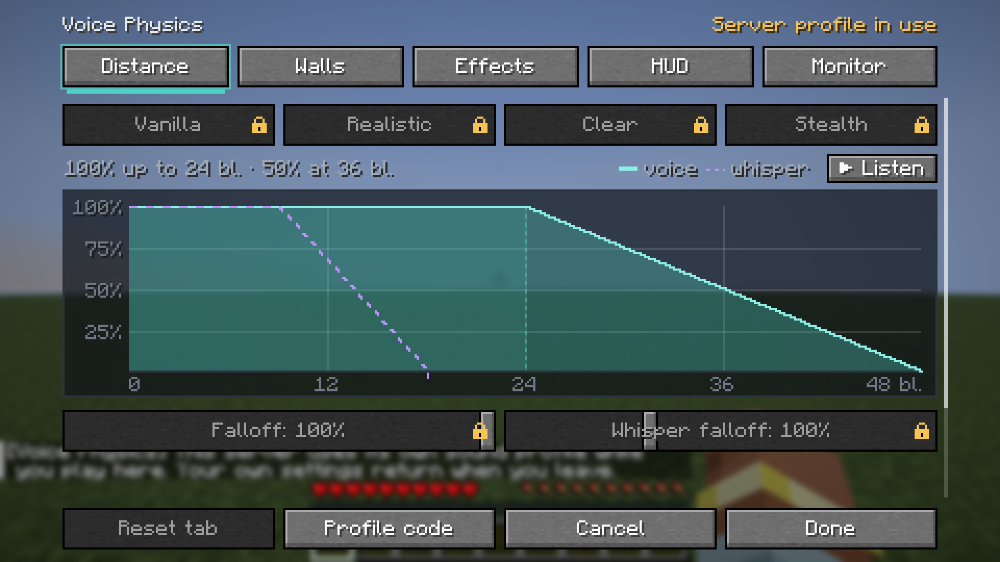

# Voice Physics

[English](README.md) · **Русский**

Аддон для [Simple Voice Chat](https://modrinth.com/plugin/simple-voice-chat), с которым голоса ведут себя как звук: затихают с расстоянием, глохнут за стенами, доносятся из-за угла через проёмы и отдаются эхом в пещерах. Серверу — звуковые зоны, правила игры и приглушение стенами даже для игроков без аддона.

[](https://modrinth.com/project/u8mD6TL9)
[](https://www.curseforge.com/projects/1712556)
[](https://github.com/Shamanalle/voice-physics/releases)
[](#версии-и-файлы)
[](LICENSE)

| Дистанция | Стены | Эффекты | HUD |
|---|---|---|---|
|  |  |  |  |

| Сервер | Журнал изменений | Настройки закреплены сервером |
|---|---|---|
|  |  |  |

## Содержание

- [Быстрый старт](#быстрый-старт)
- [Для игроков](#для-игроков)
- [Для серверов](#для-серверов)
- [Что где работает](#что-где-работает)
- [Версии и файлы](#версии-и-файлы)
- [Совместимость](#совместимость)
- [Команды](#команды)
- [Файлы настроек](#файлы-настроек)
- [Вопросы и проблемы](#вопросы-и-проблемы)
- [Сборка](#сборка)

## Быстрый старт

**Какой файл:** на Fabric, Quilt, Forge и NeoForge — полный аддон, свой файл для каждого диапазона версий Minecraft. Серверам Paper, Purpur, Folia и Spigot — плагин. Точный файл для вашей версии — в разделе [Версии и файлы](#версии-и-файлы).

**Игрок**
1. Установите [Simple Voice Chat](https://modrinth.com/plugin/simple-voice-chat) и, на Fabric, [Fabric API](https://modrinth.com/mod/fabric-api).
2. Положите `.jar` аддона в `.minecraft/mods/`.
3. В игре нажмите `V` → **Voice Physics…** или введите `/voicephysics` (также в Mod Menu или на своей клавише в «Управлении»). Изменения слышны сразу; «Отмена» возвращает как было.

**Сервер**
1. Fabric, Forge или NeoForge: положите тот же `.jar` в `mods/`. Paper, Purpur, Folia или Spigot: положите `voice-physics-bukkit-*.jar` в `plugins/` (на CurseForge у плагина [своя страница](https://www.curseforge.com/projects/1715914)). Нужен установленный Simple Voice Chat.
2. Запустите сервер один раз. Стены для игроков без аддона уже включены.
3. Остальное настраивается командой `/vcd` в игре, на вкладке «Сервер» в экране настроек или в [файле настроек](#файл-сервера). Файл перечитывается без перезапуска.

## Для игроков

Для этого нужен аддон у вас; работает на любом сервере с Simple Voice Chat.

### Дистанция
- Три кривые затухания: как в Simple Voice Chat (ровная), реалистичная или крутая. Любая кривая сходит на нет к краю дальности, а не обрывается.
- Вы задаёте, как далеко голос слышно в полную силу, как быстро он тихнет, насколько громким остаётся на краю и как быстро тихнет шёпот.
- Живой график показывает громкость на любом расстоянии и тех, кого вы слышите сейчас. Кнопка «Прослушать» проигрывает голос, уходящий вдаль по кривой.
- Пресеты сами подстраиваются под дальность голоса на сервере:

  | Пресет | Для чего | Полная громкость до |
  |---|---|---|
  | Ваниль | Ровно как Simple Voice Chat | половины дальности |
  | Реализм | Обычная игра | ~12 блоков |
  | Чётко | Ивенты: всех хорошо понятно | ~24 блоков |
  | Стелс | Прятки, хоррор | ~7 блоков |

### Стены
- Голос за стеной тише и глуше; чем толще стена, тем сильнее.
- Материалы разные: шерсть и металл глушат сильнее камня, стекло и листва слабее. Открытые двери и люки считаются на десятую часть закрытых; полублоки, заборы и ковры пропускают звук по своей форме. Железные и медные двери считаются металлом. Вес каждого материала меняется на вкладке «Стены», в разделе «Материалы».
- Двое рядом в узком тоннеле слышат друг друга чисто.
- Блоки из других модов: аддон угадывает материал по названию и звуку блока. Если угадал неверно, выберите блок, на который смотрите или который держите, на вкладке «Стены» или пусть ресурспак либо мод перечислит его в [файле данных](#материалы-блоков-для-авторов-модов).

### Из-за угла
- Голос из соседней комнаты идёт через дверной проём или окно — с его стороны и на длину пути в обход.
- Чем круче поворот, тем глуше голос. Когда вы проходите мимо проёма, направление смещается плавно.
- В HUD у таких голосов пометка «из-за угла».

### Эхо, вода и дождь
- Эхо зависит от места: каменная комната звенит коротко, пещера или зал — 2–3 секунды, деревянный дом — коротко и мягко. В лесу, в поле и в комнате из шерсти эха нет.
- У скал и в каньонах голос возвращается через мгновение.
- Место говорящего тоже учитывается: друг в пещере звучит гулко, даже если вы снаружи. Голос рядом с вами остаётся чистым.
- Эхо меняется плавно, примерно за полторы секунды, когда вы заходите из поля в пещеру или выходите из зала.
- *По месту* (включено по умолчанию): измерение, биом и глубина чуть подстраивают звук. В глубоких пещерах и в глубинной тьме эхо дольше, дым Незера глушит дальние голоса, в открытой пустоте Энда эха нет, снег и густые джунгли поглощают звук. Подстройка мягкая и идёт поверх измеренного; на вкладке «Эффекты» её можно выключить.
- Под водой голоса глухие и тише.
- Под открытым небом дождь и гроза заглушают дальние голоса.
- На вкладке «Эффекты» — переключатель для каждого, ползунки силы эха, воды и дождя и то, в каком месте вы сейчас.

### HUD
- Небольшая панель в углу экрана: кто говорит, как далеко, с какой стороны, шепчет ли, за стеной или из-за угла.
- Пока вы говорите: сколько игроков вас слышат и сколько не могут (нет голосового чата, выключен звук). В группе Simple Voice Chat считается группа (нужен аддон на сервере).
- Режимы: выкл., когда кто-то говорит, всегда. Размер (50–200%), угол, фон, компактный режим в одну строку, с предпросмотром на вкладке «HUD». Клавиша переключает режимы.
- **Удобнее видеть и следить:** «Высокий контраст» рисует HUD на сплошной тёмной панели с яркими буквами. «Метки направления» добавляют строку в духе субтитров для того, кто говорит сбоку, например `◀ Sam 3m`, чтобы понять, откуда идёт голос, без стереослуха.

### Монитор и радар
- Все в радиусе голоса, говорят они или нет: расстояние, направление, с какой громкостью доходит голос и сколько отнимают стены.
- У кого нет голосового чата, у кого он не подключён, кто выключил звук и кто в группе.
- Радар показывает то же сверху.
- Невидимые игроки, наблюдатели и скрытые плагинами ваниша не показываются.

### Ещё
- **Коды профиля:** скопируйте все свои настройки звука одной строкой и отправьте другу — он вставит её у себя.
- **Цвета для дальтоников** в HUD, мониторе и радаре — на вкладке «HUD».
- **Без тормозов на загруженных компьютерах:** аддон использует один общий просмотр блоков для всех своих измерений и шаг за шагом замедляет собственные измерения, когда игра занята. Нагрузку показывает `/voicephysics report`.
- **Баг-репорт одним кликом:** `/voicephysics report` выдаёт короткий текст (версии, настройки, нагрузка, последние проблемы; без имён) с кнопкой «Копировать».
- **Семь языков:** русский, английский, украинский, немецкий, испанский, бразильский португальский, китайский (упрощённый).

## Для серверов

Есть в полных модах для Fabric, Forge и NeoForge и в виде плагина для Paper, Purpur, Folia, Spigot и Bukkit.

- **Стены для всех.** Игроки без аддона тоже слышат голоса за стенами приглушёнными. Нагрузка ограничена: сверх 24 голосов одновременно (настраивается) остальные проходят без фильтра, а при любой ошибке уходит исходный звук, так что голосовой чат не замолчит.
- **Звуковые зоны.** Выделите бокс в игре через `/vcd zone`, возьмите целый мир, регион WorldGuard на Paper или приваты игрока либо группы из [Open Parties and Claims](https://modrinth.com/mod/open-parties-and-claims) на Fabric, Forge и NeoForge. Зона может:
  - менять дальность голоса: сцена ×2, библиотека ×0.4 или дальность в блоках;
  - быть *изолированной*: голоса не входят и не выходят;
  - задавать свою силу стен, постоянное эхо (собор) или его отсутствие;
  - показывать сообщение при входе.

  Вход в зону и выход из неё показываются над хотбаром всем игрокам, с аддоном и без (`/vcd notices off` выключает). `/vcd zone show <имя>` рисует границы бокса частицами.
- **Правила игры.** На корточках голос слышно ближе. Мёртвых не слышно до возрождения. Наблюдателей слышат только наблюдатели. Предмет в руке, например козий рог, работает как мегафон. Вы выбираете, какие правила действуют и внутри групп Simple Voice Chat.
- **Один звук для всех.** Предложите игрокам профиль звука сервера кнопкой или закрепите его, пока они на сервере (честное PvP и ивенты). Закрепите всё или только часть: кривую, стены, материалы, эффекты. Закреплённые стены закрепляют и проценты каждого блока.
- **Без взгляда сквозь стены.** Можно выключить монитор, радар и игроков рядом в HUD.
- **Обязательный аддон.** Игрокам с Simple Voice Chat, но без аддона можно один раз дать ссылку на скачивание, напоминать при каждом входе или кикать. Игроков без голосового чата это не касается.
- **Реализм для игроков без аддона (по умолчанию выключен).** `/vcd effects on` заставляет сервер глушить голоса под водой, заглушать дальние в дождь и грозу и давать эхо помещения, где стоит говорящий или слушающий: та же физика, что аддон делает у себя. `/vcd effects air on` ещё и слегка глушит голоса у края дальности. Вода, дождь и воздух работают на любой платформе; измерение помещения для эха требует доступа к блокам и есть только на Paper, а зона с собственным эхом работает везде. Силы берутся из профиля (`/vcd effects water|weather|echo <0-150>`). Это даёт нагрузку, поэтому выключено, пока вы не включите.
- **Заглушение.** `/vcd mute <игрок> [время] [причина]` лишает игрока голоса для всех — на время (`10m`, `2h`, `1d`, `perm`) или до `/vcd unmute`. `/vcd mutes` показывает, кто заглушен и почему, с кнопкой «Снять». Заглушения переживают перезапуск и попадают в журнал изменений.
- **Дополнения (Paper, по умолчанию выключены, ещё не опробованы в живой игре).** `/vcd extras` показывает их с переключателем у каждого, те же переключатели (и коэффициент подслушивания) есть на вкладке «Сервер» экрана настроек, если на сервере стоит плагин; сначала включайте на тестовом сервере, `/vcd undo` возвращает. **Рация** (`/voice radio <1-9999>`: игроки на одной частоте слышат друг друга на любом расстоянии, при желании только с предметом в руке), **громкоговорители** (`/vcd speaker add`: того, кто говорит у него, слышно из него вокруг), **предмет для подслушивания** (подзорная труба делает стены тоньше), **реакция скалка** (крик — игровое событие, на которое реагируют вардены и скалковые датчики), **звук через дверной проём** (за стеной голос идёт через открытую дверь, а не через стену) и **интеграции** (города Towny и земли Lands как зоны, флаг WorldGuard `vcd-zone`, контексты LuckPerms `vcd:mode`, `vcd:walls`, `vcd:zone`).
- **PlaceholderAPI (Paper).** Если установлен [PlaceholderAPI](https://modrinth.com/plugin/placeholderapi), в скорбордах, табе, голограммах и форматах чата можно показывать [плейсхолдеры `%vcd_...%`](#плейсхолдеры): кто говорит, режим, дальность, заглушен ли игрок.
- **Статистика (плагин).** Плагин отправляет в [bStats](https://bstats.org) анонимные цифры использования (размер сервера и версии, какие опции включены; без имён, адресов и чата), чтобы силы шли туда, где ими пользуются. Выключается `metrics=false` в файле сервера или для всех плагинов в `plugins/bStats/config.yml`.
- **Инструменты админа.** Вкладка «Сервер» в экране настроек (там же эффекты для игроков без аддона и переключатели дополнений плагина; громкоговорители, предметы и заглушение остаются командами), [`/vcd`](#команды) с кликабельными ответами, примерами в справке, отменой и отдельными правами, журнал того, кто что менял, на отдельном экране (вкладка «Сервер» → «Весь журнал» или `/voicephysics log`) и в виде `/vcd log`, `/vcd debug <игрок>` — кого слышит игрок и почему не слышит остальных, `/vcd report` — баг-репорт для копирования, сообщения на языке каждого игрока (все тексты можно менять).

## Что где работает

Колонки сервера: *мод* — аддон Fabric, Forge или NeoForge на сервере, *плагин* — плагин для Paper, Purpur, Folia или Spigot. *Вместе* — аддон на клиенте и любой из них на сервере.

| | Только клиент | Только сервер: мод | Только сервер: плагин | Вместе |
|---|:---:|:---:|:---:|:---:|
| Кривая громкости, пресеты | ✅ | — | — | ✅ + профиль сервера |
| Стены | ✅ для вас | ✅ для игроков без аддона | ✅ для игроков без аддона | ✅ |
| Из-за угла | ✅ | — | звук через проём (дополнение Paper) | ✅ |
| Эхо помещения | ✅ | — | Paper, если включено | ✅ |
| Вода, дождь | ✅ | если включено | если включено | ✅ |
| Эхо по месту (пещеры, Незер, Энд) | ✅ | — | — | ✅ |
| HUD, монитор, радар | ✅ | — | — | ✅ + состояние голосового чата у всех |
| Зоны: дальность, стены, изоляция, название над хотбаром | — | ✅ + Open Parties and Claims | ✅ + WorldGuard, Towny, Lands | ✅ |
| Зоны: эхо | — | если включены эффекты | если включены эффекты | ✅ |
| Правила игры, обязательный аддон, заглушение, `/vcd`, журнал изменений, `/vcd report` | — | ✅ | ✅ | ✅ |
| `/voice`, PlaceholderAPI | — | — | Paper, Folia | Paper, Folia |
| Дополнения: рация, громкоговорители, подслушивание, скалк, LuckPerms | — | — | Paper | Paper |
| Вкладка «Сервер», закреплённые настройки, выключенный монитор | — | — | — | ✅ |
| Точная дальность шёпота на графике | примерная | — | — | ✅ |

Если аддон стоит и там, и там, стены глушит сам клиент, а сервер этих игроков пропускает, так что дважды ничего не глушится.

## Версии и файлы

| Загрузчик | Minecraft | Файл | Java | Simple Voice Chat |
|---|---|---|---|---|
| **Fabric / Quilt** | 1.16.5 | `voice-physics-fabric-2.11.0+mc1.16.5.jar` | 8+ | 2.4.0+ |
| **Fabric / Quilt** | 1.17.1 | `voice-physics-fabric-2.11.0+mc1.17.1.jar` | 16+ | 2.4.0+ |
| **Fabric / Quilt** | 1.18.2 | `voice-physics-fabric-2.11.0+mc1.18.2.jar` | 17+ | 2.4.0+ |
| **Fabric / Quilt** | 1.19.2 | `voice-physics-fabric-2.11.0+mc1.19.2.jar` | 17+ | 2.4.0+ |
| **Fabric / Quilt** | 1.19.4 | `voice-physics-fabric-2.11.0+mc1.19.4.jar` | 17+ | 2.4.0+ |
| **Fabric / Quilt** | 1.20 – 1.20.1 | `voice-physics-fabric-2.11.0+mc1.20.1.jar` | 17+ | 2.4.0+ |
| **Fabric / Quilt** | 1.20.2 – 1.20.4 | `voice-physics-fabric-2.11.0+mc1.20.2-1.20.4.jar` | 17+ | 2.4.0+ |
| **Fabric / Quilt** | 1.20.5 – 1.20.6 | `voice-physics-fabric-2.11.0+mc1.20.5-1.20.6.jar` | 21+ | 2.5.0+ |
| **Fabric / Quilt** | 1.21 – 1.21.11 | `voice-physics-fabric-2.11.0+mc1.21.x.jar` | 21+ | 2.5.0+ |
| **Fabric / Quilt** | 26.1 – 26.3 | `voice-physics-fabric-2.11.0+mc26.x.jar` | 25+ | 2.6.0+ |
| **Forge** | 1.16.5 | `voice-physics-forge-2.11.0+mc1.16.5.jar` | 8 – 16 | 2.4.0+ |
| **Forge** | 1.17.1 | `voice-physics-forge-2.11.0+mc1.17.1.jar` | 16+ | 2.4.0+ |
| **Forge** | 1.18.2 | `voice-physics-forge-2.11.0+mc1.18.2.jar` | 17+ | 2.4.0+ |
| **Forge** | 1.19.2 | `voice-physics-forge-2.11.0+mc1.19.2.jar` | 17+ | 2.4.0+ |
| **Forge** | 1.19.4 | `voice-physics-forge-2.11.0+mc1.19.4.jar` | 17+ | 2.4.0+ |
| **Forge** | 1.20 – 1.20.1 | `voice-physics-forge-2.11.0+mc1.20.1.jar` | 17+ | 2.4.0+ |
| **Forge** | 1.20.2 – 1.20.4 | `voice-physics-forge-2.11.0+mc1.20.2-1.20.4.jar` | 17+ | 2.4.0+ |
| **Forge** | 1.20.6 | `voice-physics-forge-2.11.0+mc1.20.6.jar` | 21+ | 2.5.0+ |
| **Forge** | 1.21 – 1.21.1 | `voice-physics-forge-2.11.0+mc1.21-1.21.1.jar` | 21+ | 2.5.0+ |
| **Forge** | 1.21.3 – 1.21.5 | `voice-physics-forge-2.11.0+mc1.21.3-1.21.5.jar` | 21+ | 2.5.0+ |
| **Forge** | 1.21.6 – 1.21.8 | `voice-physics-forge-2.11.0+mc1.21.6-1.21.8.jar` | 21+ | 2.5.0+ |
| **Forge** | 1.21.9 – 1.21.10 | `voice-physics-forge-2.11.0+mc1.21.9-1.21.10.jar` | 21+ | 2.5.0+ |
| **Forge** | 1.21.11 | `voice-physics-forge-2.11.0+mc1.21.11.jar` | 21+ | 2.5.0+ |
| **Forge** | 26.1 – 26.3 | `voice-physics-forge-2.11.0+mc26.x.jar` | 25+ | 2.6.0+ |
| **NeoForge** | 1.20.1 | `voice-physics-forge-2.11.0+mc1.20.1.jar` | 17+ | 2.4.0+ |
| **NeoForge** | 1.20.2 – 1.20.3 | `voice-physics-neoforge-2.11.0+mc1.20.2-1.20.3.jar` | 17+ | 2.4.0+ |
| **NeoForge** | 1.20.4 | `voice-physics-neoforge-2.11.0+mc1.20.4.jar` | 17+ | 2.4.0+ |
| **NeoForge** | 1.20.5 – 1.20.6 | `voice-physics-neoforge-2.11.0+mc1.20.5-1.20.6.jar` | 21+ | 2.5.0+ |
| **NeoForge** | 1.21 – 1.21.1 | `voice-physics-neoforge-2.11.0+mc1.21-1.21.1.jar` | 21+ | 2.5.0+ |
| **NeoForge** | 1.21.2 – 1.21.5 | `voice-physics-neoforge-2.11.0+mc1.21.2-1.21.5.jar` | 21+ | 2.5.0+ |
| **NeoForge** | 1.21.6 – 1.21.8 | `voice-physics-neoforge-2.11.0+mc1.21.6-1.21.8.jar` | 21+ | 2.5.0+ |
| **NeoForge** | 1.21.9 – 1.21.10 | `voice-physics-neoforge-2.11.0+mc1.21.9-1.21.10.jar` | 21+ | 2.5.0+ |
| **NeoForge** | 1.21.11 | `voice-physics-neoforge-2.11.0+mc1.21.11.jar` | 21+ | 2.5.0+ |
| **NeoForge** | 26.1 – 26.3 | `voice-physics-neoforge-2.11.0+mc26.x.jar` | 25+ | 2.6.0+ |
| **Paper / Purpur / Folia / Spigot / Bukkit** | 1.16.5 – 26.3 | `voice-physics-bukkit-2.11.0.jar` | 8+ (17+ с 1.18) | версия для Bukkit |

- **Fabric**, **Forge** и **NeoForge** — полный аддон, для клиента и сервера. Для Fabric нужен [Fabric API](https://modrinth.com/mod/fabric-api); [Mod Menu](https://modrinth.com/mod/modmenu) — по желанию. На Forge для 1.21.6 – 1.21.7 нет HUD голоса: этот Forge не умеет его добавлять. NeoForge 1.20.1 — ответвление Forge 1.20.1 и берёт файл для Forge. Файлу для NeoForge 1.20.4 нужен NeoForge 20.4.80 или новее.
- **Старый Minecraft** (1.16.5 – 1.19.4) получает те же возможности, что и новые файлы. Сам Simple Voice Chat всё ещё обновляется для 1.16.5, 1.18.2 и 1.19.2, а для 1.17.1 и 1.19.4 остановился на 2.5.12, с которой аддон работает. Forge 1.16.5 работает на Java 8 – 16, Fabric 1.16.5 на 8 и новее, Fabric 1.17.1 и Forge 1.17.1 на 16 и новее. Minecraft 1.19.3 не собирается.
- **Плагин** — только серверная часть. Заходить можно с аддоном, без него или вообще без модов.

## Совместимость

- **Sound Physics Remastered:** если он установлен, аддон по умолчанию оставляет стены, эхо и воду ему, чтобы ничего не применялось дважды; дождь продолжает работать. Чтобы голоса звучали через аддон, нажмите «Использовать наш» в заметке на вкладке «Стены» или «Эффекты» (или поставьте `over_sound_physics=true` в [файле клиента](#файл-клиента)). Тогда аддон снимает с голосов фильтры Sound Physics Remastered и применяет свои стены, эхо и воду; все остальные звуки игры остаются за Sound Physics Remastered. Это ваш выбор, сервер его не закрепляет.
- **Группы Simple Voice Chat:** группа слышит своих где угодно, поэтому стены и дальность внутри неё не действуют. Правила игры действуют только там, где их включил сервер.
- **Плагины ваниша** (Paper): скрытые игроки скрыты и в мониторе.

## Команды

### Для игроков: `/voicephysics`

Работает на любом сервере, с аддоном на нём или без.

| Команда | Что делает |
|---|---|
| `/voicephysics` | Открыть настройки |
| `/voicephysics distance\|walls\|effects\|hud\|monitor\|server` | Открыть настройки на этой вкладке |
| `/voicephysics preset vanilla\|realistic\|clear\|stealth` | Ваш пресет звука |
| `/voicephysics hud off\|talking\|always`, `hud compact on\|off` | HUD голоса |
| `/voicephysics code` | Ваш код профиля с кнопкой «Копировать» |
| `/voicephysics code <код>` | Загрузить код профиля |
| `/voicephysics reset curve\|walls\|materials\|effects\|hud\|all` | Сбросить по умолчанию |
| `/voicephysics status` | Что сервер делает с вашим звуком: его профиль, что он закрепил, ваша зона, дальность голоса |
| `/voicephysics report` | Баг-репорт для копирования: версии, ваши настройки, нагрузка, последние проблемы (без имён) |
| `/voicephysics log` | Журнал изменений сервера на отдельном экране (для админов): страницы, изменения одного игрока, отмена, копирование |
| `/voicephysics help` | Эти команды, по ним можно кликнуть |

То, что закрепил сервер, отсюда тоже не поменять.

### Для игроков без мода: `/voice` (Paper, Folia)

| Команда | Что делает |
|---|---|
| `/voice` или `/voice status` | Ваш выбор кнопками: каждое значение меняется кликом, есть «Отменить» |
| `/voice mode quiet\|normal\|shout` | Как далеко слышен ваш голос: вдвое ближе, обычно, вдвое дальше (для `shout` нужно право `vcd.shout`) |
| `/voice walls on\|off` | Глушат ли стены голоса, которые вы слышите (не там, где сервер закрепил стены или зона задаёт свои: там решает сервер) |
| `/voice volume <игрок> <0-100>` | Насколько громко этот игрок звучит для вас (не для игроков с аддоном: их громкость в меню голосового чата) |
| `/voice ignore <игрок>`, `/voice unignore <игрок>` | Перестать слышать игрока и отменить это (работает для всех) |
| `/voice hud on\|off` | Над хотбаром — имена и расстояния тех, кто говорит рядом (для игроков без аддона) |
| `/voice menu` | Тот же выбор в виде меню-инвентаря |
| `/voice radio [1-9999\|off]` | Настроить рацию: игроки на одной частоте слышат друг друга на любом расстоянии (если сервер включил рацию; если задан `radio_item`, держите этот предмет) |
| `/voice undo` | Отменить ваше последнее изменение |
| `/voice reset` | Вернуть по умолчанию |

`/voice` доступна всем (право `vcd.player`); у каждой части есть своё право под ним (`vcd.player.mode`, `.walls`, `.hud`, `.volume`, `.menu`, `.radio`), так что сервер может отобрать любую. Выбор сохраняется в `vc-audio-distance-players.properties` рядом с настройками сервера.

### Плейсхолдеры

С [PlaceholderAPI](https://modrinth.com/plugin/placeholderapi) на Paper они работают в скорбордах, табе, голограммах и форматах чата. Больше ничего не нужно: плагин добавляет их сам.

| Плейсхолдер | Что показывает |
|---|---|
| `%vcd_mode%` | Режим игрока из `/voice`: `quiet`, `normal` или `shout` |
| `%vcd_mode_name%` | То же словом на языке игрока |
| `%vcd_talking%` | `true`, пока игрок говорит (у заглушенного никогда) |
| `%vcd_muted%` | `true`, если игрок заглушен |
| `%vcd_mute_left%` | Сколько ещё длится заглушение (`1h`, `perm`) или пусто |
| `%vcd_mute_reason%` | Почему игрок заглушен или пусто |
| `%vcd_range%` | Как далеко сейчас слышен голос игрока, в блоках (с учётом режима, зоны, приседания и мегафона) |
| `%vcd_whisper_range%` | То же для шёпота |
| `%vcd_walls%` | `true`, если стены глушат голоса, которые слышит этот игрок |
| `%vcd_zone%` | Название звуковой зоны, где стоит игрок, или пусто |
| `%vcd_addon%` | `true`, если у игрока есть аддон |
| `%vcd_talking_near%` | Кто говорит рядом с игроком и слышен ему, сначала ближние, например `» Bob 4m, Anna 10m`; пусто, если сервер это скрывает (`allow_monitor=false`) или людей скрывает плагин ваниша |
| `%vcd_muted_count%` | Сколько игроков заглушено (одинаково для всех) |

Имя, которого PlaceholderAPI не знает, остаётся как написано.

### Для серверов: `/vcd`

Ответы цветные и кликабельные: по значению в `/vcd status` в чат подставляется команда, которая его меняет, у зон в `/vcd zones` есть кнопки «Подробнее», «Показать» и «Туда», у каждого изменения — кнопка «Отменить». Tab подсказывает имена зон, миров и игроков и значения каждого параметра. Изменения сохраняются в файл настроек и сразу доходят до игроков.

| Команда | Что делает |
|---|---|
| `/vcd` или `/vcd status` | Версия, дальность голоса, стены, игроки с аддоном, профиль, зоны |
| `/vcd help [команда]` | Все команды или одна с примерами, по которым можно кликнуть |
| `/vcd undo` | Отменить последнее изменение (до 10) |
| `/vcd log [страница] [игрок]` | Кто и когда менял настройки, сначала новые, по десять на странице; с ником — только изменения этого игрока (также в `vc-audio-distance-changes.log` рядом с файлом настроек) |
| `/vcd block add\|remove\|list\|clear` | Блоки и теги блоков (`create:andesite_casing`, `#c:glass_blocks`), которые считаются отдельным материалом, для всех на сервере; игроки могут добавить и свои на вкладке «Стены» |
| `/vcd reload` | Перечитать файл настроек |
| `/vcd profile off\|suggest\|enforce` | Как предлагается профиль сервера |
| `/vcd preset vanilla\|realistic\|clear\|stealth\|custom` | Звук сервера |
| `/vcd preset export` / `import <код>` | Профиль сервера в виде кода профиля |
| `/vcd walls 0-100\|off` | Сила стен для всех, в % |
| `/vcd serverwalls on\|off` | Стены для игроков без аддона |
| `/vcd effects [on\|off]` | Вода, дождь и эхо от сервера для игроков без аддона (по умолчанию выключены); без значения — что включено, с кнопками |
| `/vcd effects air on\|off` | Голоса слегка глохнут у края дальности (для игроков без аддона) |
| `/vcd effects water\|weather\|echo <0-150>\|off` | Насколько сильно каждое; это значения профиля сервера, так что их получают и игроки с аддоном |
| `/vcd lock all\|none\|curve,walls,materials,effects` | Что игроки не могут менять, пока профиль закреплён |
| `/vcd monitor on\|off` | Монитор, радар и игроки рядом в HUD |
| `/vcd notices on\|off` | Название зоны над хотбаром при входе и выходе |
| `/vcd zones [страница]` | Все зоны, с кнопками |
| `/vcd zone pos1\|pos2 [x y z \| ~ ~ ~ \| look]` | Угол бокса: где вы стоите, по координатам или блок, на который вы смотрите. Выделение показывается частицами |
| `/vcd zone create <имя> [радиус]` | Бокс по двум углам или вокруг вас |
| `/vcd zone info [имя]` | Настройки зоны; по любой можно кликнуть, чтобы изменить. Без имени — зона, где вы стоите |
| `/vcd zone set <имя\|claim:игрок> <параметр> [значение\|default]` | `mode`, `preset`, `voice_range`, `whisper_range`, `range_multiplier`, `walls`, `echo`, `isolated`, `message`, `priority`. Без значения — текущее и варианты |
| `/vcd zone show <имя>\|off` | Показать границы бокса частицами на 30 секунд (видите только вы) |
| `/vcd zone tp <имя>` | Переместиться в центр бокса |
| `/vcd zone rename <имя> <новое имя>` | Переименовать бокс; настройки остаются |
| `/vcd zone delete <имя>` | Удалить зону (сначала спросит; `/vcd undo` вернёт её) |
| `/vcd rule sneak 0.1-1\|dead on\|off\|spectators on\|off\|megaphone <предмет>\|megaphone_range 1-10` | Правила игры |
| `/vcd group dead\|spectators\|zones\|open_range on\|off` | Правила внутри групп Simple Voice Chat |
| `/vcd require off\|suggest\|warn\|kick [версия]` | Обязательный аддон |
| `/vcd mute <игрок> [время] [причина]` | Игрока никто не слышит `30s`, `10m`, `2h`, `1d`, `1w` или `perm` (без времени — пока не снимут); повторное заглушение меняет время и причину |
| `/vcd unmute <игрок>` | Снова можно слышать игрока |
| `/vcd mutes` | Кто заглушен, на сколько и почему, у каждого кнопка «Снять» |
| `/vcd extras [название on\|off]` | Дополнения плагина Paper и их переключатели: `radio`, `speakers`, `eavesdrop`, `sculk`, `doorway`, `integrations` (все выключены, пока не включены; ещё не опробованы в живой игре) |
| `/vcd radio [item <id>\|none]` | Рация: состояние, кто в эфире на какой частоте, предмет, который нужно держать |
| `/vcd speaker [list]`, `add <имя> [радиус] [захват]`, `tp <имя>`, `remove <имя>` | Громкоговорители: того, кто говорит в пределах `захвата` блоков (0.5 - 16), слышат из него все в пределах `радиуса` блоков (1 - 256) |
| `/vcd eavesdrop [item <id>\|none\|factor <0.05-1>]` | Предмет для подслушивания (по умолчанию `minecraft:spyglass`) и сколько от приглушения стенами остаётся держащему его (по умолчанию 0.3) |
| `/vcd debug [игрок]` | Кого слышит игрок, кто слышит его и почему нет (без имени — вы) |
| `/vcd report` | Баг-репорт для копирования: версии, настройки, меняющие звук голосов, нагрузка, последние проблемы (без имён игроков и зон) |

**Права.** Консоли можно всё. На Paper у каждой части `/vcd` своё право; у операторов есть все:

| Право | Что разрешает |
|---|---|
| `vcd.status` | `status`, `help`, `zones`, `zone info`, `effects` (просмотр) |
| `vcd.settings` | `profile`, `preset`, `walls`, `serverwalls`, `effects` (изменение), `extras`, `radio`, `eavesdrop`, `lock`, `monitor`, `notices`, `rule`, `group`, `require`, `block`, `reload`, `undo`, `log` |
| `vcd.zone` | Создавать, менять, показывать и удалять зоны |
| `vcd.debug` | `debug`, `report` |
| `vcd.mute` | `mute`, `unmute`, `mutes` |
| `vcd.speaker` | `speaker add`, `remove`, `tp` |
| `vcd.admin` | Всё перечисленное |

На Fabric, Forge и NeoForge `/vcd` доступна операторам (уровень 2+). С LuckPerms или другим модом на fabric-permissions-api Fabric проверяет те же права. Вкладка «Сервер» видна всем, кому доступна хоть одна часть `/vcd`.

## Файлы настроек

Всё это можно настроить и в игре. У каждого ключа в файлах есть комментарий на английском и русском.

### Файл клиента

`config/vc-audio-distance.properties`

<details>
<summary>Все настройки клиента</summary>

| Ключ | Значения | По умолчанию | Что делает |
|---|---|---|---|
| `distance_model` | `linear` / `realistic_inverse` / `exponential` | `linear` | Форма кривой |
| `attenuation_factor` | 0 – 1 | 1.0 | Как быстро тихнут голоса |
| `openal_reference_ratio` | 0.05 – 1 | 0.5 | Доля дальности с полной громкостью |
| `min_volume_fraction` | 0 – 0.5 | 0.0 | Громкость на краю дальности |
| `whisper_multiplier` | 0.5 – 2 | 1.0 | Как быстро тихнет шёпот относительно голоса |
| `occlusion_enabled` | true / false | true | Стены глушат голоса |
| `occlusion_strength` | 0 – 1 | 0.6 | Насколько сильно |
| `material.<id>` | 0 – 3 | см. «Стены» → «Материалы» | Насколько глушит один блок; камень = 1 |
| `reverb_enabled` | true / false | true | Эхо |
| `reverb_strength` | 0 – 1 | 0.6 | Сила эха |
| `underwater_enabled` | true / false | true | Глухие голоса под водой |
| `underwater_strength` | 0 – 1.5 | 1 | Насколько глухими и тихими становятся голоса под водой |
| `weather_enabled` | true / false | true | Дождь и гроза заглушают дальние голоса |
| `weather_strength` | 0 – 1.5 | 1 | Насколько сильно |
| `diffraction_enabled` | true / false | true | Голоса из-за угла |
| `place_tuning` | true / false | true | Измерение, биом и глубина чуть подстраивают эхо и воздух |
| `over_sound_physics` | true / false | false | При установленном Sound Physics Remastered: голосам стены, эхо и воду даёт этот аддон, а не он |
| `hud_mode` | `off` / `talking` / `always` | `talking` | Когда показывать HUD |
| `hud_corner` | `top_left` / `top_right` / `bottom_left` / `bottom_right` | `top_right` | Угол для HUD |
| `hud_scale` | 0.5 – 2 | 1.0 | Размер HUD |
| `hud_background` | 0 – 1 | 0.55 | Непрозрачность фона HUD |
| `hud_compact` | true / false | false | Одна строка HUD на всех говорящих |
| `hud_contrast` | true / false | false | HUD на сплошной тёмной панели с яркими буквами |
| `hud_markers` | true / false | false | Строка со стрелкой в духе субтитров для голосов сбоку |
| `colorblind` | true / false | false | Цвета для красно-зелёного дальтонизма |

</details>

### Файл сервера

`config/vc-audio-distance-server.properties` на Fabric, Forge и NeoForge, `plugins/VoicePhysics/vc-audio-distance-server.properties` на Paper (до 2.2.0 — `plugins/VoicechatAudioDistance/`, папка переносится сама). Изменения применяются в течение 2 секунд. Сама дальность голоса и шёпота задаётся в Simple Voice Chat (`max_voice_distance`, `whisper_distance`).

<details>
<summary>Стены</summary>

| Ключ | Значения | По умолчанию | Что делает |
|---|---|---|---|
| `walls_strength` | 0 – 1 | 0.6 | Насколько сильно глушат стены, для всех; 0 выключает стены |
| `material.<id>` | 0 – 3 | камень 1.0, металл 1.3, земля 0.9, дерево 0.7, шерсть 1.4, мягкие 1.2, стекло 0.4, лёд 0.7, двери 0.6, листва 0.15, решётки и заборы 0.2, жидкости 0.35, остальные 1.0 | Насколько глушит один блок |
| `server_walls` | true / false | true | Сервер глушит стены для игроков без аддона |
| `server_walls_max_streams` | 0 – 512 | 24 | Сколько голосов глушится одновременно; остальные проходят без фильтра |

</details>

<details>
<summary>Профиль сервера (игроки с аддоном)</summary>

| Ключ | Значения | По умолчанию | Что делает |
|---|---|---|---|
| `profile_mode` | `off` / `suggest` / `enforce` | `off` | Свои настройки / кнопка «применить профиль» / профиль действует, пока игрок на сервере |
| `profile_locked` | `all`, `none` или любые из `curve,walls,materials,effects` | `all` | При `enforce`: что игроки не могут менять; `walls` закрепляет и `materials` |
| `profile_preset` | `vanilla` / `realistic` / `clear` / `stealth` / `custom` | `custom` | Звук сервера; `custom` берёт ключи `profile.*` |
| `profile.distance_model`, `.attenuation_factor`, `.openal_reference_ratio`, `.min_volume_fraction`, `.whisper_multiplier` | как в файле клиента | как у клиента | Своя кривая |
| `profile.reverb_enabled`, `.reverb_strength`, `.underwater_enabled`, `.underwater_strength`, `.weather_enabled`, `.weather_strength`, `.diffraction_enabled`, `.place_tuning` | как в файле клиента | как у клиента | Эффекты; входят в профиль при любом пресете |
| `allow_monitor` | true / false | true | `false`: нет монитора, радара и игроков рядом в HUD |
| `zone_notices` | true / false | true | Название зоны над хотбаром при входе и выходе, у всех игроков |

</details>

<details>
<summary>Зоны</summary>

| Ключ | Значения | Что делает |
|---|---|---|
| `zone.<вид>.<имя>.voice_range`, `.whisper_range` | 1 – 1000 блоков | Дальность голоса и шёпота здесь |
| `zone.<вид>.<имя>.range_multiplier` | 0.05 – 10 | Дальность умножается: 2 — сцена, 0.4 — библиотека |
| `zone.<вид>.<имя>.isolated` | true / false | Голоса не входят и не выходят |
| `zone.<вид>.<имя>.walls_strength` | 0 – 1 | Сила стен здесь; решает за всех в зоне (0 — без стен), что бы они ни выбрали через `/voice walls` |
| `zone.<вид>.<имя>.echo` | `auto` / `off` / 0.1 – 1 | Как измерено / без эха / такое эхо везде в зоне |
| `zone.<вид>.<имя>.profile_mode`, `.profile_preset` | как выше | Профиль здесь |
| `zone.<вид>.<имя>.enter_message` | текст | Показывается при входе |
| `zone.<вид>.<имя>.priority` | целое число | Где зоны пересекаются, побеждает высший (по умолчанию 0) |
| `zone.box.<имя>.world`, `.from`, `.to` | мир, `x,y,z`, `x,y,z` | Сам бокс; его записывает `/vcd zone create` |

`<вид>` — `world`, `box`, `region` (WorldGuard, Paper), `town` (Towny, Paper), `land` (Lands, Paper) или `claim` (Open Parties and Claims: `zone.claim.<игрок>` — приваты этого игрока, а для лидера группы — всей группы; `zone.claim.server` — приваты самого сервера). Мир на Paper — имя его папки (`world_nether`), на Fabric, Forge и NeoForge — измерение (`the_nether`). При равном приоритете побеждает регион, затем меньший бокс. Чего в зоне нет, берётся из остального файла.

```properties
# Сцена, которую слышно вдвое дальше, и звуконепроницаемая кабинка
zone.box.stage.world=world
zone.box.stage.from=0,60,0
zone.box.stage.to=30,80,20
zone.box.stage.range_multiplier=2
zone.box.stage.enter_message=На сцене: вас слышат все
zone.box.booth.world=world
zone.box.booth.from=40,60,0
zone.box.booth.to=44,64,4
zone.box.booth.isolated=true
```

</details>

<details>
<summary>Реализм для игроков без аддона, заглушения и статистика</summary>

| Ключ | Значения | По умолчанию | Что делает |
|---|---|---|---|
| `server_effects` | true / false | false | Сервер глушит голоса под водой, заглушает дальние в дождь и грозу и даёт эхо помещения (эхо: Paper); силы берутся из `profile.underwater_*`, `profile.weather_*` и `profile.reverb_*` |
| `server_air` | true / false | false | Голоса слегка глохнут у края дальности |
| `mute.<uuid>` | `конец\|имя\|кто заглушил\|причина` | нет | Заглушенный игрок; `конец` — время в миллисекундах с 1970 года, 0 — пока не снимут. Их пишет `/vcd mute`; истёкшие удаляются |
| `metrics` | true / false | true | Только плагин: анонимные цифры использования в [bStats](https://bstats.org) |

</details>

<details>
<summary>Дополнения плагина Paper (по умолчанию выключены)</summary>

| Ключ | Значения | По умолчанию | Что делает |
|---|---|---|---|
| `server_radio` | true / false | false | Рация: игроки на одной частоте (`/voice radio`) слышат друг друга на любом расстоянии |
| `radio_item` | id предмета или пусто | пусто | Предмет, который нужно держать, чтобы пользоваться рацией, например `minecraft:clock`; пусто — предмет не нужен |
| `server_speakers` | true / false | false | Громкоговорители, поставленные через `/vcd speaker add`, повторяют голоса вокруг себя |
| `speaker.<имя>` | `мир\|x\|y\|z\|захват\|радиус` | нет | Громкоговоритель; эти строки пишет `/vcd speaker add` |
| `server_eavesdrop` | true / false | false | Предмет для подслушивания делает стены тоньше для держащего его |
| `eavesdrop_item` | id предмета или пусто | `minecraft:spyglass` | Предмет; пусто — никто не может |
| `eavesdrop_factor` | 0.05 – 1 | 0.3 | Сколько от приглушения стенами остаётся держащему |
| `server_sculk` | true / false | false | Крик или голос с мегафоном — игровое событие для скалковых датчиков и варденов (не чаще раза в 3 с на игрока) |
| `server_doorway` | true / false | false | Игроки без аддона слышат голос за стеной из открытой двери, через которую он идёт |
| `server_integrations` | true / false | false | `zone.town.*` (Towny), `zone.land.*` (Lands), флаг WorldGuard `vcd-zone` и контексты LuckPerms `vcd:mode`, `vcd:walls`, `vcd:zone` |

Всё это новое и ещё не опробовано в живой игре: сначала включайте на тестовом сервере. Флаг WorldGuard `vcd-zone` принимает имя зоны из этого файла (`/region flag <регион> vcd-zone quiet-library`).

</details>

<details>
<summary>Правила игры и группы</summary>

| Ключ | Значения | По умолчанию | Что делает |
|---|---|---|---|
| `sneak_range_multiplier` | 0.1 – 1 | 1 | Дальность голоса на корточках умножается на это |
| `dead_players_silent` | true / false | false | Мёртвых не слышно до возрождения |
| `spectators_hear_only_spectators` | true / false | false | Наблюдателей слышат только наблюдатели |
| `megaphone_item` | id предмета или пусто | пусто | Предмет-мегафон, например `minecraft:goat_horn` |
| `megaphone_multiplier` | 1 – 10 | 2.5 | Дальность голоса с мегафоном умножается на это |
| `group_dead_silent` | true / false | false | Мёртвых не слышит и их группа |
| `group_spectators_apart` | true / false | false | Наблюдателей в группе слышат только её наблюдатели |
| `group_isolated_zones` | true / false | false | Изолированные зоны отрезают и голоса групп |
| `open_group_range` | true / false | true | В открытых группах дальность зон, корточки и мегафон действуют на голос, который слышат игроки рядом |

</details>

<details>
<summary>Обязательный аддон и сообщения</summary>

| Ключ | Значения | По умолчанию | Что делает |
|---|---|---|---|
| `require_addon` | `off` / `suggest` / `warn` / `kick` | `off` | Игрокам без аддона: ничего / одно сообщение за запуск сервера / сообщение при каждом входе / отключение |
| `min_addon_version` | версия или пусто | пусто | Минимальная версия аддона |
| `addon_download_url` | ссылка | релизы на GitHub | Куда сообщение отправляет игроков |
| `messages_language` | `auto` / `en_us` / `ru_ru` / `uk_ua` / `de_de` / `es_es` / `pt_br` / `zh_cn` | `auto` | Язык ответов `/vcd` и сообщений игрокам; `auto` — язык игры каждого игрока |

Тексты лежат в `vc-audio-distance-lang/<язык>.json` рядом с файлом настроек. Меняйте любые строки или добавьте файл, например `fr_fr.json`, для нового языка; недостающие строки берутся из встроенных.

</details>

### Материалы блоков для авторов модов

Ресурспак, датапак или собственный jar мода могут сообщить аддону, из чего сделан блок, для блоков, которые автоматическое определение угадывает неверно. Для ванильных блоков ничего не нужно.

- `assets/<пространство имён>/voice_physics/materials.json` читает клиент (ресурспаки и jar модов);
- `data/<пространство имён>/voice_physics/materials.json` читает сервер, который измеряет стены (датапаки, jar модов, `datapacks/` мира).

```json
{
  "replace": false,
  "blocks": {
    "create:andesite_casing": "metal",
    "#minecraft:beds": "wool"
  }
}
```

Ключ — id блока или тег блоков (`#пространство:тег`); значение — один из материалов вкладки «Стены»: `stone`, `metal`, `earth`, `wood`, `wool`, `soft`, `glass`, `ice`, `door`, `leaves`, `thin`, `liquid`, `other`. Пак выше в списке побеждает для того же блока, а `"replace": true` отбрасывает сказанное нижними паками. Ошибки (неизвестный материал, сломанный JSON) пропускают запись, попадают в лог (первые пять) и видны в разделе «Problems» в `/voicephysics report` и `/vcd report`; всего читается до 4096 правил.

Кто побеждает, когда про один блок сказано несколько раз: собственные правила сервера (`/vcd block`) и игрока (вкладка «Стены»), затем датапаки, затем ресурспаки и jar модов, затем автоматическое определение. Стены, закреплённые профилем сервера, закрепляют и проценты каждого блока.

## Вопросы и проблемы

**Я не слышу приглушения стенами.**
- Проверьте, что «Стены» включены и выше 0% на вкладке «Стены». `/voicephysics status` скажет, если сервер закрепил стены для всех или выключил их.
- Голоса внутри одной группы Simple Voice Chat стены и дальность игнорируют намеренно.
- Если установлен [Sound Physics Remastered](https://modrinth.com/mod/sound-physics-remastered), аддон оставляет стены, эхо и воду ему, если не нажать «Использовать наш» на вкладке «Стены».
- Без аддона сервер глушит стены только при `server_walls` и только до 24 голосов одновременно (`server_walls_max_streams`); у игрока может быть выключено `/voice walls`.

**Настройка серая или возвращается назад.** Сервер закрепил свой профиль и заблокировал эту часть. `/voicephysics status` перечисляет, что закреплено; на сервере это меняется через `/vcd lock`.

**Нет HUD.** `/voicephysics hud talking` включает его. Сервер может скрыть монитор и игроков рядом (`allow_monitor=false`). На Forge для 1.21.6 – 1.21.7 HUD нет вообще.

**Аддон не делает вообще ничего.** Simple Voice Chat должен стоять и на сервере, и у вас, нужной версии из [таблицы](#версии-и-файлы), а на Fabric ещё и Fabric API. Подключён ли голосовой чат, видно в логе сервера и в `/vcd status`.

**Блок из другого мода глушит неверно.** На вкладке «Стены» добавьте блок, на который смотрите или который держите, и выберите материал; для всего сервера — `/vcd block add <id> <материал>`. Авторы модов и паков могут положить [файл данных](#материалы-блоков-для-авторов-модов).

**Игроки без аддона не слышат воду, дождь и эхо.** По умолчанию это выключено: `/vcd effects on`. Вода, дождь и воздух работают на любой платформе; эхо помещения измеряется только на Paper, но зона с собственным эхом работает везде. Перезапуск не нужен.

**Игра тормозит, когда говорит много людей.** Аддон сам замедляет свои измерения, когда игра занята; нагрузку показывает `/voicephysics report`. Если всё равно тяжело, выключите переключатель «из-за угла» на вкладке «Эффекты» или уменьшите `server_walls_max_streams` на сервере.

**Как сообщить об ошибке?** Выполните `/voicephysics report` (в игре) или `/vcd report` (на сервере), нажмите «Копировать» и вставьте текст в [issue](https://github.com/Shamanalle/voice-physics/issues). В нём версии, настройки, меняющие звук голосов, нагрузка и последние проблемы; имён игроков и зон, адресов и чата в нём нет.

**Что плагин отправляет в bStats?** Только то, что bStats сам собирает для любого плагина (серверное ПО и версии, число игроков, страна), и четыре признака этого плагина: режим профиля сервера, включены ли стены на сервере и серверный реализм и есть ли зоны. Имена, адреса, чат и значения настроек не отправляются никогда. Выключается `metrics=false` в файле сервера.

## Сборка

Нужен JDK 25.

```bash
git clone https://github.com/Shamanalle/voice-physics.git
cd voice-physics
./gradlew build   # все JAR окажутся в build/libs/
```

Устройство проекта и как помочь: [CONTRIBUTING.md](CONTRIBUTING.md). Изменения по версиям: [CHANGELOG.md](CHANGELOG.md).

## Лицензия

[MIT](LICENSE) © Shamanalle
